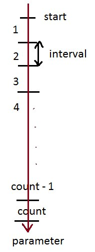

```
     ____                ________  ________
    / __ \___  ___ ___  / ___/ _ \/ __/ __/
   / /_/ / _ \/ -_) _ \/ (_ / ___/\ \_\ \
   \____/ .__/\__/_//_/\___/_/  /___/___/
       /_/           by NotSoOld, 2017 (c)
   
   направляй|обрабатывай|собирай статистику
```

---

# OpenGPSS - Инструкция (бета 0.3)

## Содержание
[Основное](#Основное)

[Объявление переменных и структур:](#Объявление-переменных-и-структур)

- [Простые переменные](#Простые-переменные)

- [Структурные типы](#Структурные-типы)

- [Массивы и матрицы](#Массивы-и-матрицы)

- [Условные функции](#Условные-функции)

[Присоединяемые (attachable) модули функций Python]()

[О неоднозначности имен](#О-неоднозначности-имен)

[Конфигурационный файл интерпретатора](#Конфигурационный-файл-интерпретатора)

[Исполняемые блоки:](#Исполняемые-блоки)

[inject](#inject---добавление-транзактов-в-систему)
\-- [queue_enter](#queue_enter---войти-в-очередь-для-сбора-статистики)
\-- [queue_leave](#queue_leave---покинуть-очередь-для-сбора-статистики)
\-- [fac_enter](#fac_enter---занять-устройство)
\-- [fac_leave](#fac_leave---покинуть-устройство)
\-- [fac_irrupt](#fac_irrupt---принудительно-занять-устройство-с-транзактами)
\-- [fac_goaway](#fac_goaway---go-away-from-previously-interrupted-facility)
\-- [reject](#reject---delete-xact-entirely-from-system)
\-- [wait](#wait---move-xact-to-fec-for-some-amount-of-time)
\-- [transport/transport_prob/transport_if](#transport-family-blocks---------transport-xact-or-fork-the-path-of-xact)
\-- [if/else_if/else](#ifelse_ifelse---make-xact-follow-different-paths-according-to-some-condition)
\-- [wait_until](#wait_until---block-xact-movement-until-condition-becomes-true)
\-- [chain_enter](#chain_enter---move-xact-to-one-of-user-chains)
\-- [chain_leave](#chain_leave---take-xacts-from-user-chain)
\-- [chain_purge](#chain_purge---take-all-xacts-from-the-user-chain)
\-- [chain_pick](#chain_pick---take-xacts-which-satisfy-a-condition)
\-- [chain_find](#chain_find---take-xacts-from-user-chain-by-index)
\-- [hist_add](#hist_add---add-a-sample-to-the-histogram)
\-- [while](#while---do-i-really-need-to-describe-what-it-does-d)
\-- [loop_times](#loop_times---do-something-as-much-times-as-you-need)
\-- [copy](#copy---make-a-full-copy-of-a-xact)
\-- [output](#output---print-something-when-you-need-to)
\-- [xact_report](#xact_report---print-all-information-about-xact-executing-this-block)
\-- [move](#move---just-skip-that-line)
\-- [interrupt](#interrupt---force-interpreter-to-go-to-next-time-beat)
\-- [review_cec](#review_cec---force-interpreter-to-look-through-cec-from-beginning)
\-- [flush_cec](#flush_cec---clear-cec-entirely)
\-- [pause_by_user](#pause_by_user---halt-simulation-until-user-presses-any-key)

[Встроенные функции:]()

- [Генераторы случайных чисел]()

- [Конвертеры типов]()

- [find()]()

- [find_minmax()]()

- [Математические функции]()

[Результаты моделирования](#Результаты-моделирования)

[Ошибки и предупреждения](#Ошибки-и-предупреждения)


## Основное
Программа на языке OpenGPSS выглядит следующим образом:

```
*область определения переменных*
*условие выхода*
{{
исполняемая область
}}
*опциональная область определения переменных*
{{
еще одна исполняемая область
}}
и т.д.
```

Область определения содержит определения переменных и структур (устройств, очередей, меток и т.д.), которые используются при имитации системы. Каждая линия определения примерно выглядит так:
- для переменных:

`тип имя = начальное значение;`
- для структур:

`тип имя {начальные параметры};`

Каждая строка в OpenGPSS заканчивается точкой с запятой. Если в конце строки нет точки с запятой, это значит, что эта же строка продолжается на следующей линии (т.е. можно записывать длинные строки в несколько линий).
Комментарии - как в Си:
`// Это однострочный комментарий`
```
/* А это - многострочный
комментарий */
```

Во время имитации условие выхода проверяется в конце каждого такта, чтобы убедиться, не пора ли прекращать имитацию модели. Условие выхода определяется ОДИН раз:

`exitwhen(выражение с булевым результатом);`

Когда выражение станет истинно, имитация закончится.

Двойные фигурные скобки `{{` и `}}` отделяют область определения от исполняемой области. Исполняемая область - это область перемещения транзактов, их добавления и удаления, обработки и т.д. Исполняемая область содержит исполняемые блоки:

`необяз.имя_метки : имя_блока(параметры блока);`

присвоения переменным или параметрам транзактов (++/-- также считаются за присвоения):

`необяз.имяметки : имя_переменной = новое_значение/выражение;`

`необяз.имяметки : имя_переменной++;`

и одиночные скобки для блоков *if*/*else_if*/*else*/*while*/*loop_times*.

К параметрам транзактов можно обратиться через точку:

`xact.p1, xact.str5, xact.my_parameter, xact.priority`

(*priority*, приоритет - это специальный параметр, который по умолчанию есть у каждого транзакта; он используется интерпретатором для имитации модели)

Любая исполняемая строка может начинаться с метки (после которой стоит двоеточие - разделитель). Если метка присутствует, это значит, что транзакт можно переместить на этот блок, зная имя метки. **НЕЛЬЗЯ** адресовать метками одиночные фигурные скобки, это приведет к ошибкам (адресуйте блоки до или после них).

Если транзакт достигает какой-нибудь исполняемой строки, он пытается выполнить ее (кроме фигурных скобок и блока *inject* - последний исполняется автоматически время от времени), при этом, если блоку нужны какие-либо параметры транзакта, испольуются параметры именно исполняющего транзакта.

Практически каждый параметр (за исключением специально оговоренных случаев) - имя структуры, выражения в условиях - могут быть не просто словами-строками, а целыми выражениями любой сложности (с операторами +, -, \*, /, ** (возведение в степень), % (остаток от деления), ~ (косвенная адресация) и встроенными функциями). Они будут превращены в значения перед вызовом блока. (исключение - начальные значения параметров, в том числе блока *inject*, т.к. они передаются "как есть", без проверки на выражение. Размеры массивов и начальные значения переменных могут быть выражениями.).

В модели во время имитации есть два важных списка (цепи): *цепь будущих событий*, ЦБС, и *цепь текущих событий*, ЦТС. Время в модели течет дискретно и измеряется в тактах. Каждый такт ЦБС просматривается для извлечения транзактов, которым пора продолжать движение в текущем такте (время продолжения движения указано вместе с транзактом, когда тот находится в ЦБС). Итак, эти транзакты будут извлечены в ЦТС, где, после сортировки транзактов по приоритету, интерпретатор будет просматривать ЦТС транзакт за транзактом, пытаясь продвинуть каждый транзакт по модели, пока тот: а) не будет извлечен из модели б) не будет заблокирован в) не переместится из ЦТС в цепь пользователя г) не выполнит блок *wait*.

В случае а) транзакт будет удален из ЦТС (и из модели совсем).

В случае б), который может быть вызван попыткой занять полностью заполненное устройство или пройти блок *wait\_until*, транзакт останется в ЦТС до следующего такта, во время которого он попытается продвинуться снова.

В случае в) транзакт будет перемещен из ЦТС в одну из цепей пользователя.

В случае г) транзакт будет перемещен в ЦБС с указанием времени дальнейшего продвижения, которое блок *wait* выставит сам.

Новые транзакты могут быть добавлены в модель с помощью блоков *inject* и *copy*. Блок *inject* создает *инжектор* - он добавляет один транзакт в ЦБС с указанием времени выхода в ЦТС (согласно параметрам инжектора). Когда этот транзакт покидает ЦБС, он указывает инжектору, что пора добавить в ЦБС следующий транзакт, и процесс повторяется. Блок *copy* создает копии транзакта, который его исполняет, и эти копии добавляются в ЦТС.

Существует особая ситуация под названием "Пересмотр ЦТС". Когда интерпретатор получает сигнал о том, что нужно пересмотреть ЦТС, он прерывает продвижение текущего транзакта и начинает просмотр ЦТС с самого ее начала. Вызвать пересмотр ЦТС могут, к примеру, такие блоки, как *fac\_leave* или *review\_cec*, а также изменение *приоритета* транзакта. (Зачем так сделано? Эти действия могут влиять на течение процесса моделирования. К примеру, если какой-то транзакт покидает заполненное устройство, то оно становится доступным для транзактов, ожидающих на его входе; но эти транзакты не двигаются, т.к. были заблокированы до этого. При пересмотре ЦТС с начала эти транзакты смогут занять устройство. А изменение приоритета транзакта может влиять на порядок обработки транзактов, на порядок их поступления в устройства, поэтому ЦТС также должна быть пересмотрена.)


## Объявление переменных и структур

**Для всех типов:**

Имя переменной (для получения его в виде строки) может быть получено через точку: *имя\_переменной.name*.

Существует возможность разыменовывания переменных (с помощью тильды, "~"). Т.е. если в какой-то переменной содержится имя другой переменной, то, разыменовав ее, можно получить значение именно второй переменной, имя которой указано в первой переменной:
```
str var1 = "var2";
int var2 = 5;

~var1++; <== значение переменной "var2" увеличится на 1
```

**Также:**

У текущего транзакта (который исполняет блок или операцию присваивания) есть несколько доступных параметров (вкупе с его собственными параметрами). К ним можно обратиться с помощью оператора ".":
```
xact.index
xact.group
```

### Простые переменные:

- int

	Просто переменная, которая может содержать целочисленное значение и доступна по своему имени. Диапазон значений - см. инструкцию языка Python.
	
	Доп. информация:
	
	\- Если целочисленной переменной присвоить значение с плавающей точкой, то оно будет автоматически обрезано до целочисленного.
	
	\- В модели имеется три целочисленных переменных, которые доступны всегда (но только для чтения):
	
	**injected** - количество введенных в модель транзактов;
	
	**rejected** - количество транзактов, извлеченных из модели с помощью блока *reject*;
	
	**curticks** - количество просимулированных тактов (текущий такт моделирования)
	
- float

	Переменная, которая способна хранить значение с плавающей точкой. Диапазон опять же такой же, как в Python.
	
- str

	Переменная, хранящая строку. В то время, как к числовым переменным можно применять все доступные операции, строки можно только присваивать и соединять.
	
- bool

	Переменная, хранящая логическое значение (true/false). Булевы переменные можно только присваивать (и применять в логических выражениях).
	
### Структурные типы:

- fac (facility, устройство)

	Это устройство, которое может быть занято транзактами. Обычно устройство используют, чтобы моделировать что-нибудь, что может быть занято кем-то или чем-то на определенный срок и тем самым остановить продвижение остальных транзактов (те будут ждать, пока устройство освободится). Таким образом, пока устройство имеет свободные места, транзакты могут в него заходить и занимать эти места, но когда устройство заполнено (т.е. занято) транзактами полностью, остальным транзактам придется ждать, пока оно освободится.
	
	Начальные параметры (задаются в фигурных скобках):
	
	\- isQueued = bool *(по умолчанию - true)* - если true, это устройство будет автоматически дополнено очередью, как будто бы имеются блоки *queue\_enter* и *queue\_leave* снизу и сверху от блока *fac\_enter*. Очередь будет названа так же, как называется устройство.
	
	\- places = int *(по умолчанию - 1)* - количество мест в устройстве, т.е. как много транзактов могут занять устройство одновременно до его полной блокировки.
	
	Доступные параметры (с помощью оператора "."):
	
	\- curplaces - сколько свободных мест доступно сейчас

	\- maxplaces - сколько мест имеет устройство в целом

	\- enters_f - сколько транзактов уже успели войти в это устройство

	\- isAvail - текущий статус доступности устройства (это НЕ статус "имеет/не имеет свободных мест", см. блок *fac\_avail*)
	
- queue (очередь)

	Очередь - это приспособление, которое чаще всего используется для сбора статистики о потоке транзактов в определенном месте модели (например, на входе устройства, т.к. именно там чаще всего собираются очереди из транзактов). Собранная статистика будет включать в себя количество вошедших транзактов, среднюю и максимальную длины очереди, среднее время ожидания в очереди и многое другое. Важно понимать, что очередь не является приспособлением для сбора транзактов в некий буфер или для их сортировки - оно не влияет на поток транзактов и лишь наблюдает за ним, записывая определенные параметры.
	
	Начальные параметры: нет.
	
	Доступные параметры (с помощью оператора "."):
	
	\- curxacts - сколько транзактов в данный момент находится в очереди

	\- enters_q - сколько транзактов успели войти в очередь на данный момент
	
- mark (метка)

	Это определение перемещающей метки, которая затем может быть использована в исполняемой части программы. Когда метка находится слева от ':' в строке, она определяет строку, куда транзакты должны быть перемещены, когда данная метка упоминается как точка назначения. Когда метка является аргументом любого из блоков, который способен переносить транзакты в модели, она определяет соответствущую строку в программе, куда транзакт должен направиться.
	
	Начальные параметры: нет.
	
	Доступные параметры: нет.
	
	Доп. информация:
	
	\- Вы всегда будете видеть предупреждения о неопределенных или неиспользуемых метках.
	
- chain (цепь пользователя)

	Цепи пользователя используются как место для хранения транзактов, когда Вам нужно управлять их перемещением в модели. Цепи пользователя позволяют помещать транзакты в буфер (тем самым симулируя устройства-буферы), выпускать транзакты по одному или сразу по несколько в определенную точку модели безусловно или согласно условию и т.д.
	
	Начальные параметры: нет.
	
	Доступные параметры (с помощью оператора "."):
	
	\- length - сколько транзактов находятся в цепи пользователя в данный момент
	
	\- xacts (доступен только для функций find/find\_minmax!) - список текущих транзактов в цепи пользователя
	
- hist<имя\_переменной> (гистограмма)

	Гистограммы - это один из дополнительных способов сбора статистики. Гистограммы могут хранить различные значения одного параметра, которые он принимал, пока менялся в течение симуляции модели. Имя этого параметра указывается в угловых скобках после ключевого слова *hist*. Значение этого параметра будет вычисляться и добавляться в таблицу гистограммы каждый раз, когда исполняется соответствующий блок *hist\_add*. После окончания моделирования, гистограмма будет распечатана как в виде таблицы, так и в псевдографическом виде (столбики значений).
	
	Начальные параметры (**все без исключения** должны быть указаны в фигурных скобках):
	
	\- start - первое граничное значение гистограммы
	
	\ interval - постоянный размер интервала между границами значений "столбиков" (интервалов) гистограммы
	
	\- count - сколько всего будет "столбиков" (без учета интервала от минус бесконечности до *start* и от последней границы до плюс бесконечности).
	
	Графическое представление:
	
	
	
	При добавлении очередного значения параметра в таблицу будет выбран соответствующий интервал, куда это значение попадает. Каждый интервал содержит количество входов значений в него.
	
	Доступные параметры (через "."):
	
	\- enters_h - сколько раз значения добавлялись в гистограмму
	
	\- average - среднее значение наблюдаемого параметра
	
- graph<параметр\_х, параметр\_у> (2D-график)

	Графики - еще один дополительный способ сбора статистики об изменениях тех или иных величин модели. Данный тип позволяет отслеживать изменение двух величин в виде графика (т.е. одна из величин является величиной по оси Х, вторая - по оси Y, и запоминаются они парами). Согласно законам математики, каждому значению Х может соответствовать только одно значение по Y, поэтому, если в таблицу графика будет добавлена пара (X, Y) такая, что Х уже существует в таблице, то итоговая пара будет следующей: (X, (старый\_Y + Y) / 2).
	
	Так как график невозможно построить средствами псевдографики, данный тип выводится в результатах как таблица собранных пар значений. Далее, используя эту таблицу, можно построить график, например, в Excel.
	
	Начальные параметры: нет.
	
	Доступные параметры: нет.
	
	
### Массивы и матрицы:

Переменная **любого** типа (простого или структурного, кроме *mark* и *function*!) может быть определена как массив:

```
int arr[10] = 0;
queue CPUs[4];
fac CPUs[4] { isQueued = false, places = 1 };
```

или как матрица:

```
float my_matrix[[5, 6]];
bool adjacent[[7, 7]] = false;
```

Начальные значения, указанные здесь после "=" или в фигурных скобках, будут применены для всех элементов массива/матрицы. Объем массива/матрицы постоянный и определяется один раз. Массивы размерности больше 2 не поддерживаются.

Внутри, массивы и матрицы задаются как наборы отдельных элементов, имя у которых состоит из имени массива и суффикса-индекса (так что не удивляйтесь, если увидите в логах *myarray&&5* иил нечто подобное). После завершения симуляции массивы и матрицы будут "собраны" из этих элементов обратно и распечатаны в удобочитаемом виде. Простые переменные так и будут в виде массивов/матриц, для структурных переменных каждый элемент будет расписан отдельно.


### Условные функции:

Данные функции могут быть использованы как замена блоку FUNCTION в старом GPSS. Они называются условными, потому что тело функции состоит из пар *"условие, возвращаемый результат"*, и каждый раз при вызове функции во всех парах, начиная с первой, проверяется указанное условие; если оно истинно, то возвращается соответственное значение результата, если нет, тогда проверяется условие из следующей пары.

Итак, прототип условной функции выглядит так:
```
function имя_функции(аргументы, если нужны) {
                                             условие1, результат1 |
                                             условие2, результат2 |
                                             ...
                                             условиеN, результатN
                                            };
```

Каждое условие может быть выражением с булевым значением; каждый результат может также быть выражением с любым значением. Условие и результат разделяются запятой, а пары "условие, результат" разделяются вертикальной чертой. Если ни одно условие не будет выполнено, функция вернет 0 (можно записать последнюю пару как "1, результат\_по\_умолчанию", чтобы перезаписать такое поведение).

У функции могут быть аргументы, которые будут использоваться в выражениях условия и результата. Их значения подставляются в эти выражения в тот момент, когда функция вызывается. Пожалуйста, **не** называйте аргументы так же, как переменные Вашей системы, т.к. замена идет по имени переменной (однако имена вроде "р1" разрешены, даже если в одном из выражений есть строка "xact.p1").

Простейший пример: реализация функции, возвращающей модуль числа:
```
function my_abs(value) {
                        value >= 0, value |
                        value < 0, -value     // или "1, -value", т.к. оно будет всегда верным
                       };
```


## Присоединяемые (attachable) модули функций Python

В OpenGPSS есть особый способ описывать функции на языке Python (если, например, Вы - опытный Python-программист или увлеченный математик, и нужную Вам функцию нельзя описать стандартными средствами языка OpenGPSS). Итак, функции записываются в файле с расширением *.py* и присоединяются к программе *.ogps* с помощью ключевого слова *attach* (в определяемой части программы) как модули:
```
attach calculus;
...
// Где-то в исполняемой части:
xact.str1 = calculus.derivative("x^2");
// и т.д..
```

Пример выше означает, что в папке, где находится файл *OpenGPSS Interpreter.py*, есть файл-модуль *calculus.py*, в котором объявлена функция на языке Python с каким-то телом: "def derivative(input\_string):". В файле может быть сколько угодно функций, и таких файлов может быть подключено сколько нужно, но нужно быть осторожным, следя за тем, чтобы имена модулей не совпадали друг с другом и с системными ключевыми словами.

Важно: присоединяемые модули **должны** находиться в корневой папке интерпретатора (т.е. где находится файл *OpenGPSS Interpreter.py*). Относительные и абсолютные пути не поддерживаются, лишь однословные имена файлов-модулей.


## О неоднозначности имен

OpenGPSS - язык, чувствительный к регистру. Имена могут состоять из английских букв верхнего и нижнего регистра (все русские буквы будут восприняты как пробельные символы), цифр (но не могут начинаться с цифры) и символа нижнего подчеркивания.

В некоторых случаях одинаковые имена разрешены:

\- имена структурных переменных разного типа могут быть одинаковыми (например, устройство и очередь с одинаковым названием)

\- имена массивов и имена переменных могут быть одинаковыми (int myvar, int myvar\[10], int myvar\[\[5, 4]])

**НО:**

\- **не** называйте переменные одинаково, они перепутаются (небольшое объяснение: структурные переменные используются или как аргументы блоков (и их имена отправляются в блок в виде строки, так что нет большой разницы, что это была за структура, если имя подходит блоку), или их доступные параметры возвращаются с помощью "." (нет ни одного совпадающего имени параметра среди всех структурных переменных, поэтому по имени параметра можно однозначно определить тип структуры слева от "."). А переменные в тексте программы используются просто как "my\_variable = ...", и нельзя точно сказать, что это за переменная, если их имеется несколько с таким именем)

\- **никогда** не называйте переменные ключевыми словами и именами блоков (в том числе "xact", "chxact", "curticks", "injected", "rejected" и т.д.)

\- всегда проверяйте, что имена Ваших функций/переменных/структур не совпадают с именами различных встроенных и присоединенных сущностей. Также нужно убедиться, что имена модулей и функций в них не совпадают с ключевыми словами.

(Возможно, эти правила придется дополнять в будущем.)


## Конфигурационный файл интерпретатора

В папке с файлом *OpenGPSS Interpreter.py* есть специальный файл конфигурации *opengpss\_config.cfg* (если файл отсутствует, запустите и закройте интерпретатор, он будет создан со значениями по умолчанию). Этот файл содержит настройки интерпретатора, среди которых - степень подробности логов (справочного вывода во время моделирования, например, для отладки работы модели) и несколько других полезных функций. Значения после "=" в файле конфигурации показывают, включена или выключена та или иная функция; Вы можете включать и выключать их, меняя это значение с True на False и обратно.

Список доступных функций (в скобках - значение по умолчанию):

- enable\_nice\_vt100\_codes (True) - включает тэги форматирования VT100 (работают только в консоли Linux, так что если работаете вне консоли или на Windows, можно отключить).

- results\_to\_file (False) - если включено, результаты моделирования будут распечатаны в файле "название\_модели\_results\_дата.txt". Старые результаты не перезаписываются (каждый раз будет создан новый файл с указанием даты моделирования).

- log\_to\_file (False) - если включено, логи моделирования будут сохраняться в файл "название\_модели\_log\_дата\_моделирования.txt". Файлы также не перезаписываются.

- print\_program\_in\_tokens (True) - если включено, перед моделированием распечатывает программу на экран в виде набора токенов - так, как ее видит интерпретатор. Может быть полезно для проверки распознавания названий блоков и коррекции опечаток.

- log\_xact\_trace (True) - если включено, каждое посещение транзактом исполняемого блока будет отражено соответствующей записью в логе.

- log\_xact\_blocking (True) - если включено, каждый раз, когда транзакт окажется заблокирован, будет выведено сообщение.

- log\_facility\_entering (True) - если включено, сообщения будут распечатываться при занятии устройств транзактов.

- log\_FEC\_entering (True) - если включено, будет распечатываться время выхода транзакта из ЦБС, установленное блоком wait() (каждый раз при попадании транзакта в ЦБС).

- log\_assignments (False) - если включено, при исполнении операции присваивания будут выведены ее распарсенные аргументы.

- log\_dot\_operator (False) - если включено, Вы будете видеть распарсенные левую и правую части исполняемого выражения при выполнении оператора ".".

- tick\_by\_tick\_simulation (False) - если включено, в начале каждого такта пользователь должен будет нажимать любую клавишу для продолжения моделирования (потактовое поделирование).

- block\_by\_block\_simulation (False) - поблочное моделирование - клавишу нужно будет нажимать перед каждым посещением блока транзактом (очень медленно по понятным причинам).


## Исполняемые блоки

### inject - добавление транзактов в систему
- Прототип:
```
inject(
         string групповое_имя_транзакта, 
         int время, 
         int интервал_времени, 
         int начальная_задержка,
         int ограничение_по_количеству
        ) 
        {
         parameter1 = int/float/boolean/string,
         ...
         (здесь Вы должны определить все параметры транзакта)
         ...
         priority = int/float (по умолчанию == 0)
        };
```
- Использование:

	Этот блок добавляет транзакт группы *групповое\_имя\_транзакта* в модель каждые *время* тактов до тех пор, пока не достигнет *ограничения\_по\_количеству*. Транзакты начнут свое продвижение по модели, начиная с соответствующего блока *inject*. Время между добавлениями может случайно варьироваться в пределе интервала *-интервал\_времени + время, интервал\_времени + время* по равномерному закону; также можно задать задержку перед вводом первого транзакта, указав *начальную\_задержку*, не равную 0.
	
	Параметры в фигурных скобках опциональны (просто оставьте пустые скобки или вообще не пишите их). В OpenGPSS каждый используемый при симуляции параметр нужно заранее определить в блоке-инжекторе. Ограничения на именование параметров транзакта такие же, как и для обычных переменных. Каждый параметр будет иметь неизменяемый впоследствии тип, определяемый по указанному начальному значению. Имеются следующие типы: int (целочисленный), float (число с плавающей точкой), boolean (логический) и string (строковый). *priority* (приоритет) - это специальный параметр, который, при явном его задании, будет указывать, какой приоритет имеет данная группа транзактов. Приоритет в основном влияет на порядок обработки транзактов в ЦТС, а также является универсальным параметром, который имеют абсолютно все транзакты. К параметрам транзакта можно обратиться, используя оператор "." и ключевое слово *xact*: *xact.имя\_параметра*.
- Пример:
```
inject("main", 10, 4, 0, 250) {p1 = 0, one_more_param = 'go', priority = 10};
```
- Дополнительные подробности:
	
	\- Если *ограничение\_по\_количеству* равно 0, то данный блок *inject* будет бесконечно добавлять транзакты в модель.
	
	\- *Интервал\_времени* и *начальная\_задержка* также могут быть равны нулю.
	
	\- Если аргументы *время* и *интервал\ времени* равны 0, а *ограничение\_по\_количеству* положительное, то одномоментно при запуске моделирования в систему будет добавлено одновременно столько транзактов, сколько указано в *ограничении\_по\_количеству*. (Это не особый случай работы блока, а возможность, которую можно использовать благодаря структуре кода данного блока, поэтому будьте аккуратны - если и *ограничение\_по\_количеству* будет равно 0, это приведет к бесконечному циклу.)
	
	\- Параметры с одинаковыми именами будут перезаписаны (сохранится только последняя из указанных сущностей).
	
	\- Будьте внимательны при именовании параметров, в противном случае очень быстро начнутся ошибки "Нет параметра с таким именем: ...".
	
### queue_enter - войти в очередь для сбора статистики
- Прототип:
queue_enter(
             word название_очереди
            );
```
- Использование:

	Этот блок поместит (добавит) транзакт, который исполнил этот блок, в указанную в аргументе очередь. (Необходимо помнить, что на самом деле транзакт остается на своём месте, а очередь существует лишь для сбора статистики - и уж тем более она не упорядочивает транзакты.)
	
- Пример:
```
queue_enter(CPU);
- Дополнительные подробности:

	\- Имена очередей могут быть выражениями с результатом-строкой.
	
	\- Транзакт не может войти в очередь, в которой он уже присутствует.
	
### queue_leave - покинуть очередь для сбора статистики
- Прототип:
```
queue_leave(
             word название_очереди
            );
```
- Использованиие:

	Этот блок пытается удалить исполняющий его транзакт из указанной очереди, в которой он присутствует. Если транзакт попытается покинуть очередь, в которой его нет, будет выдана ошибка.
	
- Пример:
```
queue_leave(CPU);
```
- Дополнительные подробности:

	\- Опять же, имя очереди может быть целым выражением (то же самое верно для почти всех аргументов в большинстве остальных блоков, поэтому далее это указываться не будет).
	
	\- Транзакт не может покинуть очередь, в которой его нет.
	
### fac_enter - занять устройство
- Прототип:
```
fac_enter(
          word имя_устройства,
          int объем_транзакта (по умолчанию == 1)
         );
```
- Использование:

	Этот блок используется для моделирования некоего образования, которое может быть занято транзактами (каким-то их количеством). Если в указанном устройстве есть свободные места, транзакт займет это устройство (т.е. будет отображен в списке занятости этого устройства; при этом мест в устройстве станет меньше на *объем\_транзакта*). Если устройство не может вместить в себя исполняющий транзакт, то транзакт остановится на этом блоке (это состояние называется "блокировка") и будет пытаться войти в данное устройство на каждом следующем такте моделирования.
	
	Обычно для сбора дополнительной статистики блок *fac\_enter* окружают блоками *queue\_enter* и *queue\_leave*; таким образом, можно получить информацию о том, как долго транзакты ждали своей очереди у входа в устройство, какая максимальная очередь скапливалась и т.п.
	
- Пример:
```
fac_enter(CPU);
```
- Дополнительные подробности:

	\- Устройства могут иметь автосоздаваемую очередь. Если данная функция у устройства была включена при его определении, то блоки *queue\_enter* и *queue\_leave* писать не нужно, интерпретатор так будет обрабатывать данный блок *fac\_enter*, как будто блоки очереди уже есть вокруг него.
	
	\- Если транзакт попытается войти в устройство, которое он уже занимает, возникнет ошибка.
	
### fac_leave - покинуть устройство
- Прототип:
fac_leave(
          word имя_устройства
         );
```
- Использование:

	Этот блок освобождает место(-а) в указанном устройстве путем удаления исполняющего транзакта из списка занятости устройства; проще говоря, транзакт покидает устройство, которое он занимал, и делает его доступным для других транзактов. При этом автоматически запускается просмотр ЦТС с начала для того, чтобы дать блокированным ранее транзактам возможность обрабатываться в освободившемся устройстве. Если транзакт попытается покинуть устройство, которое он не занимает, то будет выдана ошибка.
	
- Пример:
```
fac_leave(CPU);
```
- Дополнительные подробности:

	\- Исполнение этого блока запускает автоматический просмотр ЦТС с начала в этом же такте.
	
	\- Транзакт не может покинуть устройство, которое он не занимает.
	
### fac_irrupt - принудительно занять устройство с транзактами
- Прототип:
```
fac_irrupt(
           word имя_устройства,
           int объем_транзакта (по умолчанию == 1),
           bool извлечение (по умолчанию == false),
           word метка (по умолчанию == следующий за этим блок),
           word переменная_под_оставшееся_время (по умолчанию == нет)
          );
```
- Использование:
	
	Иногда необходимо не просто занять устройство, а войти в него независимо от количества свободных мест и/или прервать обработку уже зашедших транзактов. Например, человек, обслуживающийся у кого-то, может быть отвлечен внешним воздействием.
	
	Итак, указанное устройство может быть прервано транзактом с объемом *объем\_транзакта* (при этом, если свободного места в устройстве недостаточно, будет вытеснено ровно столько транзактов, сколько нужно прерывающему транзакту). Если *извлечение* равно false, вытесняемые транзакты будут перемещены из ЦТС/ЦБС в цепь прерываний указанного устройства. При этом больше никаких аргументов указывать не нужно. "Отсутствие" извлечения означает, что вытесненные в цепь прерываний транзакты продолжат свою обработку после того, как прерывающий транзакт покинет устройство с помощью блока *fac\_goaway*. Оставшееся время обработки запоминается при вытеснении, поэтому после ухода вытесняющего транзакта транзакты из цепи прерываний дообработаются за такое время, которое и должно было бы пройти при нормальной обработке.
	
	Если *вытеснение* равно true, это означает, что вытесненные транзакты будут исключены из указанного устройства совсем и не вернутся на дообработку автоматически, как в случае выше. Если присутствует *метка*, вытесненные транзакты перейдут на нее. Если присутствует *переменная\_под\_оставшееся\_время*, оставшееся время обработки вытесненного транзакта будет записано в неё.
	
- Примеры:
```
fac_irrupt(CPU, 1, True, to_elapsed, xact.p3);
fac_irrupt(fac, 1, True, '', xact.p1);
fac_irrupt(fac, 3, False);
```

- Дополнительные подробности:

	\- Если транзакт слишком "большой" (т.е. его объем больше вместительности устройства), блок будет пропущен (вместо него вызовется блок *move*).
	
	\- Если устройство полностью свободно, вместо этого блока будет вызван блок *fac\_enter*.
	
	\- Если устройство недоступно, оно не может быть прервано (вызовется блок *move*).
	
	\- Транзакт не может прервать устройство, которое он уже прерывает или занимает.
	
	\- **Всегда** ставьте в пару к этому блоку блок *fac\_goaway*, если Вы посылаете транзакты в цепь прерываний устройства, иначе эти транзакты останутся в цепи навсегда.
	
	\- Вся разница между занятием и принудительным занятием (прерыванием) устройства состоит в том, что попытка занять устройство, в котором не хватает свободных мест, приведет к блокировке, а попытка его прервать будет успешной. Транзакты внутри устройства не имеют статуса, обозначающего, каким образом они туда попали (поэтому транзакт-захватчик, по сути, также является обычным транзактом на обработке в устройстве).
	
### fac_goaway - освободить прерванное устройство и вернуть транзакты на обработку
- Прототип:
```
fac_goaway(
           word имя_устройства
          );
```
- Использование:

	После занятия устройства через прерывание его нужно покинуть с помощью данного блока (особенно, если Вы вытесняете транзакты в цепь прерываний). Когда прерывающий транзакт исполняет этот блок, он покидает устройство и возвращает на своё место столько транзактов из цепи прерываний, сколько могут поместиться на освободившиеся места.
	
- Пример:
```
fac_goaway(CPU);
```

- Дополнительные подробности:

	\- Этот блок вызывает автоматический просмотр ЦТС с начала (по тем же соображением, что и в случае с блоком *fac\_leave*).
	
	\- Если транзакт не занимает или не прерывал указанное устройство, этот блок вызывать всё равно можно (вместо ошибки будет просто вызван блок *move*). Это сделано потому, что блок *fac\_irrupt* в некоторых случаях может не исполниться.
	
### fac_avail - сделать устройство доступным для транзактов
- Прототип:
```
fac_avail(
          word имя_устройства
         );
```
- Использование:

	У устройства имеется статус доступности (т.е. работает оно или нет). Данный блок переключает статус доступности в "доступно".
	
- Пример:
```
fac_avail(CPU);
```

- Дополнительные подробности:

	\- Каждое устройство по умолчанию доступно.
	
	\- Когда устройство доступно, это означает, что оно может заниматься (при наличии свободных мест) и прерываться.
	
	\- Этот блок вызывает просмотр ЦТС с начала.
	
### fac_unavail - сделать устройство недоступным для транзактов
- Прототип:
```
fac_unavail(
            word fac_name
           );
```
- Использование:

	Иногда необходимо смоделировать закрытое (временно неработающее) устройство. Этот блок позволяет переключить статус доступности устройства на "недоступно".
	
- Пример:
```
fac_unavail(CPU);
```

- Дополнительные подробности:

	\- Когда устройство недоступно, оно не может быть занято или прервано. Транзакты перед устройством будут блокированы, как в случае полной его занятости. Транзакты внутри устройства продолжат свою обработку, пока она не завершится, поэтому, если Вам нужно закрыть устройство немедленно, прервите его, "выгнав" все транзакты, и только потом сделайте недоступным.
	 
	\- Даже если устройство недоступно, блоки *fac\_leave* и *fac\_goaway* всё равно будут работать.
	 
### reject - удалить транзакт из системы
- Прототип:
reject(
       int инкремент_счетчика_удалений
      );
```
- Использование:

	Этот блок используется для удаления транзактов из системы. Удаление означает, что транзакт прекращает своё продвижние по модели и удаляется из ЦТС. *Инкремент\_счетчика\_удалений* определяет, какое число будет добавлено к счетчику удалений (встроенной переменной *rejected*).
	
- Пример:
```
reject(1);
```
- Дополнительные подробности:

	\- Если, будучи весьма невнимательным, пытаться удалять транзакты, находящиеся внутри каких-нибудь устройств/очередей, интерпретатор автоматически удалит данный транзакт из этих устройств/очередей.
	
	\- Этот блок вызывает просмотр ЦТС с начала (из-за пункта выше - после удаления транзакта некоторые устройства могут освободиться для новых транзактов).
	
### wait - приостановить продвижение транзакта на некоторое время
- Прототип:
```
wait(
     int время_ожидания,
     int интервал (0 по умолчанию)
    );
```
- Использование:

	Этот блок используется для моделирования обработки транзакта. Он перемещает транзакт в ЦБС на время, которое выбирается случайно из интервала *время\_ожидания±интервал*. После прохождения этого времени транзакт продолжит своё движение по модели с того же места, откуда попал в ЦБС.
	
- Пример:
```
wait(8, 3);
```

### Семейство блоков transport ("->>", "->|", "->?") - переместить транзакт в модели условно или безусловно
- Прототипы:
```
->> word метка;
->| word метка_если_правда, 
    float вероятность, 
    word метка_если_ложь (по умолчанию - блок, следующий за этим)
->? word метка_если_правда,
    expression условие,
    word метка_если_ложь (по умолчанию - блок, следующий за этим)
```
- Использование:

	Эти блоки используются для перемещения транзактов внутри модели из одной точки в другую. Перемещение может быть безусловным (->>), вероятностным (->|) или условным (->?). Можно также указать, куда следовать транзактам, если проверка по вероятности/условию закончилась неудачей (по умолчанию транзакты просто пройдут на следующий блок).
	
- Примеры:
```
->> CPU_mark;
->| Mark1, 0.4, jmp;
->? mark, xact.pr > 10;
```
- Дополнительные подробности:

	\- Если вам не нравится запись данных блоков с помощью "->", можно использовать соответствующие имена блоков: *transport()*, *transport\_prob()*, *transport\_if()*.
	
### if/else_if/else - операторы ветвления
- Прототипы:
if(
   expression условие
  )
{
	блоки, которые будут выполнены, если условие истинно
}
else_if(
        expression другое_условие
       )
{
	блоки, которые будут выполнены, если другое_условие истинно
}
else_if...
...
else
{
	что выполнять, если все проверки выше ложны
}
```
- Использование:

	Эти блоки используются для того, чтобы можно было выполнять различные части программы в зависимости от истинности тех или иных условий. Выбор делается на основе условий в скобках - выполнятся те блоки в фигурных скобках, чье условие первым окажется истинным. **Фигурные скобки нельзя опускать!** 
	
	В дереве условий (т.е. в группе условий, записанных друг под другом без разрывов, как в прототипе) может быть несколько (или ни одного) блока *else\_if*; блок *else*, выполняющийся всегда, если все остальные условия в дереве ложны, также может отсутствовать.
	
- Примеры:
- Examples:
```
if(xact.f3 > 0)
{
	fac_enter(CPU1);
}
else_if(myChain != 3)
{
	fac_enter(CPU2);
}
else
{
	reject(0);
}

if(boolVar)
{
	chain_purge(ch1, toTerm);
}
else
{
	chain_enter(ch1);
}
и т.д.
```

- Дополнительные подробности:

	\- Условия могут быть вложенными (как в любом Си-подобном языке).
	
### wait_until - заблокировать продвижение транзакта условно
- Прототип:
```
wait_until(
           expression условие
          );
```

- Использование:

	Иногда бывает нужно, чтобы транзакт не двигался по определенной части модели, пока что-то не произойдет (т.е. какое-то условие не станет верным). С помощью этого блока и можно организовать подобное поведение транзактов. Если во время исполнения блока условие оказывается ложным, транзакт блокируется до следующего такта, в котором условие проверяется снова; блокировка будет происходить, пока условие не станет истинным.
	
- Пример:
```
wait_until(buffer.length > 0);
```

### chain_enter - поместить транзакт в одну из цепей пользователя
- Прототип:
```
chain_enter(
            word имя_цепи
           );
```
- Использование:

	Цепи пользователя - очень мощный механизм; с их помощью возможно моделировать буферизацию транзактов в одном месте модели и их выборку из этого буфера и перемещение в другое место модели. Данный блок помещает исполняющий транзакт в указанную цепь пользователя (транзакт будет перемещен из ЦТС в конец цепи пользователя).
	
- Пример:
```
chain_enter(buffer);
```

- Дополнительные подробности:

	\- Блоком, на котором остановился помещаемый в цепь транзакт, будет считаться тот блок, с которого он попал в эту цепь.
	
### chain_leave - выбрать транзакты из цепи пользователя
- Прототип:
```
chain_leave(
            word имя_цепи,
            int количество,
            word куда_переместить (по умолчнию - блок, следующий за этим)
           );
```

- Использование:

	Этот блок позволяет перемещать транзакты из цепи пользователя обратно в Вашу модель. Указанное количество транзактов (или меньше указанного, если в цепи недостаточно транзактов) будет выбрано из указанной цепи пользователя и перемещено на метку в аргументе *куда\_переместить* (или, если она не указана, на следующий за этим блок).
	
- Пример:
```
chain_leave(buffer, 2, tofacility);
```

### chain_purge - опустошить цепь пользователя
- Прототип:
```
chain_purge(
            word имя_цепи,
            word куда_поместить (по умолчанию - следующий за этим блок)
           );
```
- Использование:

	Блок *chain\_purge* забирает все транзакты из указанной цепи пользователя и помещает на указанную метку (или, если она не указана, на следующий за этим блок). После выполения этого блока в цепи пользователя не останется транзактов. По сути, эквивалентен блоку `chain_leave(chain, chain.length, block)`.
	
- Пример:
```
chain_purge(buffer, killmark);
```

### chain_pick - выборка транзактов по указанному для них условию
- Прототип:
```
chain_pick(
           word имя_цепи,
           условие,
           int количество,
           word куда_поместить (по умолчанию - следующий за этим блок)
          );
```
- Использование:

	В то время, как блок *chain\_leave* производит выборку безусловно, блок *chain\_pick* позволяет выбрать только те транзакты, которые удовлетворяют указанному *условию*. Условие, к примеру, может выглядеть так: "chxact.parameter ==/<=/... значение или выражение" (левая часть может быть и другой). *chxact* - новое ключевое слово, которое указывает на транзакт из цепи пользователя, который рассматривается в данный момент (исходя из логики работы данного блока: он проходит по цепи пользователя, рассматривая каждый транзакт в ней по очереди, и пытается применить к нему указанное условие). Будут выбраны *количество* или меньше транзактов, которые удовлетворяют условию.
	
	Этот блок имеет большую ценность, потому что он дает замечательную способность выбирать именно те транзакты, которые нужно выбрать согласно их параметрам или текущему состоянию цепи (например, выбрать все транзакты с приоритетом больше некоего значения или те транзакты, которые провели в цепи указанное количество времени, и т.д.).
	
- Примеры:
```
// Выбрать 3 транзакта, у которых параметр "ptime" больше 10
chain_pick(buffer, chxact.ptime > 10, 3);

// Забирать транзакты (не больше 10) из цепи "buffer", пока ее длина больше 5
chain_pick(buffer, buffer.length > 5, 10, to_kill);
```

### chain_find - условная выборка из цепи пользователя по индексу транзакта
- Прототип:
```
chain_find(
           word имя_цепи,
           int индекс_транзакта,
           int количество,
           word куда_поместить (по умолчанию - следующий за этим блок)
          );
```
- Использование:

	Так как довольно странно пытаться выбирать транзакты по их индексу (который является больше техническим параметром, зачастую неизвестным), этот блок чаще всего используется вместе со встроенными функциями *find()/find\_minmax()* (которые как раз возвращают индекс транзакта в случае поиска транзакта по условию внутри цепи). Остальное поведение соответствует блоку *chain\_pick*.
	
	Иногда этот блок можно заменить блоком, рассмотренным выше (и наоборот).
	
- Пример:
```
// Найти и удалить 5 транзактов, чей приоритет меньше 10.
chain_find(buf, find(buf.xacts.pr < 10), 5);
```


